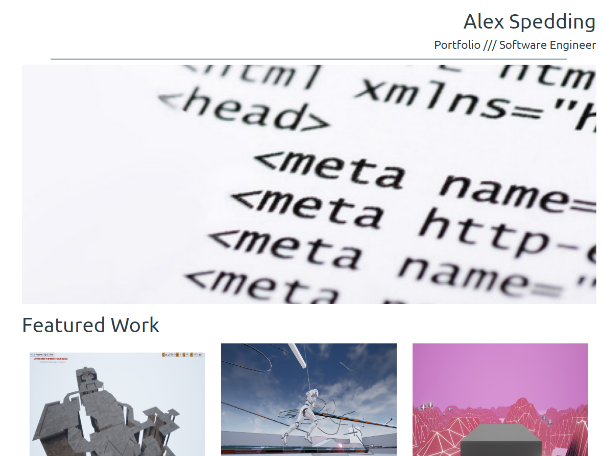

Responsive portfolio website
- HTML
- CSS
- Flexbox

Changelog post 1st code review
- HTML validates (apart from a single warning which tells me to add a h2-h6 where I don't want any heading)
- CSS validates 
- No style in HTML

Had some help on Stack Overflow with what turned out to require media queries: https://stackoverflow.com/questions/47242515/make-a-flex-div-the-same-size-as-its-content

Used my own projects rather than the ones on the guide as I felt it was more personal (can easily change this)

No building required, just open index.html in a web browser
